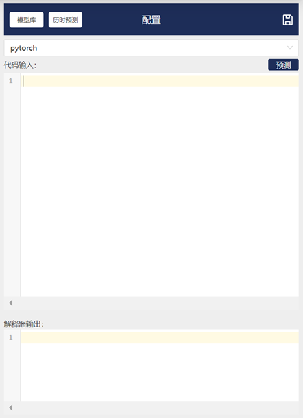
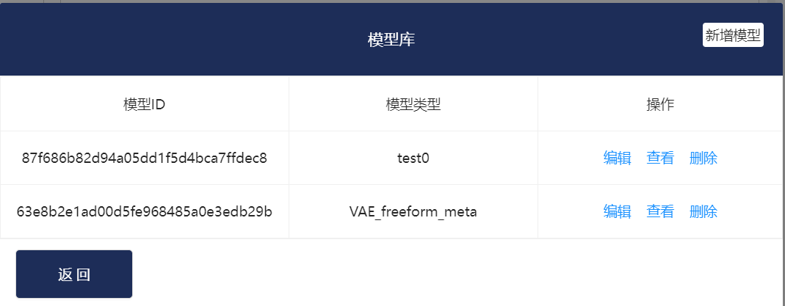
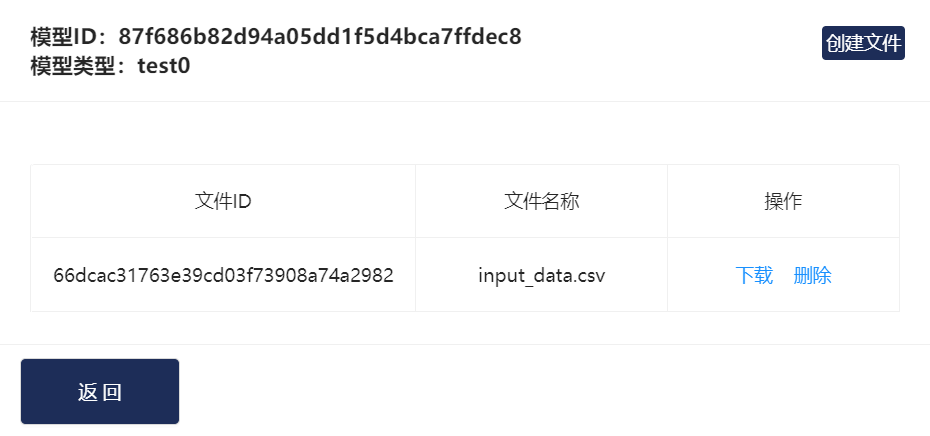
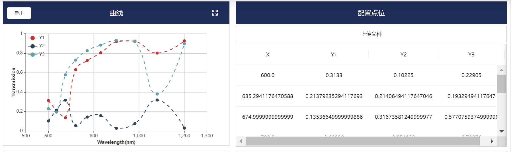
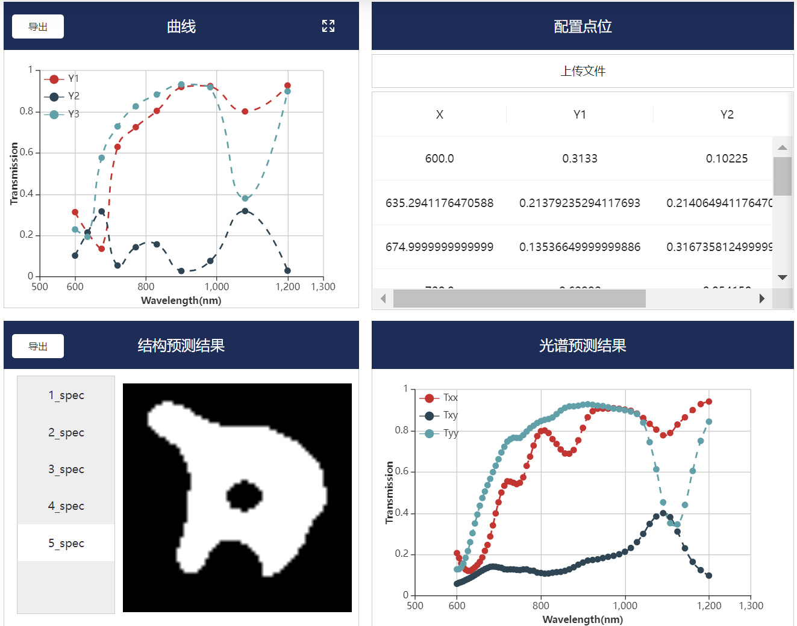

# 智能软件光谱预测

## 1. 光谱预测模块功能简介

首先点击光谱预测模块，进入初始化页面：

图1.1 光谱预测模块初始化界面

本页面的各功能模块基于VAE模型开发（VAE模型介绍详见**深度生成模型** [注：此处链接到：[深度学习模块 — Intelligent Software Design v1 文档 (intelligent-software-design.readthedocs.io)](https://intelligent-software-design.readthedocs.io/zh_CN/latest/算法/深度学习模块/深度学习模型.html#id6)]）。

本页面可分有三个功能区域：输入区、模型区、结果展示区。

输入区上传并展示传入VAE模型的光谱数据，模型区用于选择光谱预测的模型，结果展示区用于展示VAE模型的多样性预测结果。

以下是各模块的详细介绍：

+ ”曲线“模块：绘制”配置点位“模块中上传的数据。
+ ”配置点位“模块：点击”上传模型“，上传本地csv文件。csv文件格式：光谱数据按列排列，第一列为横坐标数据，其余列为纵坐标数据。
+ ”结构预测结果“模块：展示VAE模型的多样性结果。左侧深色区可以选择不同的预测结果，右侧白色区展示超表面结构。“导出”按钮导出右侧光谱预测结果的csv文件。

+ ”光谱预测结果”模块：展示左侧超表面结构对应的光谱预测结果。

 图1.2 “配置”模块

在“配置”模块中：

+ “模型库”：可添加/删除模型。点击“查看”，可上传模型中用到的模型文件。在模型中，通过“文件ID”调用上传的模型文件。

图1.3 模型库界面

图1.4 模型文件的管理界面

+ 历时预测：保存历时预测结果。通过点击右上角的保存标志保存。
+ pytorch框：算法选择框，在本模块中选择pytorch。
+ 代码输入：点击模型后，在此处输入必要的参数。（目前这里展示的是模型代码，该功能还在完善中）

+ 预测：运行模型代码，该模型对输入数据的预测。
+ 解释器输出：运行模型代码时的python解释器输出。

## 2. 光谱预测使用实例

本节以自由形状结构超表面的VAE模型（链接：[深度学习模块 — Intelligent Software Design v1 文档 (intelligent-software-design.readthedocs.io)](https://intelligent-software-design.readthedocs.io/zh_CN/latest/算法/深度学习模块/深度学习模型.html#id8)）为例。

Step1: 选择模型：

图2.1 选择模型

Step2: 上传输入模型的光谱数据。

该模型输入x的范围为600-1200，y的范围为0-1。

图2.2 上传模型数据

上传后，点位可在y方向上拖动，右侧可查看拖动后点位的精确数值。模型预测读取的是实时的输入数据。

Step3：点击“预测”，得到预测结果。

图2.3 模型预测结果
