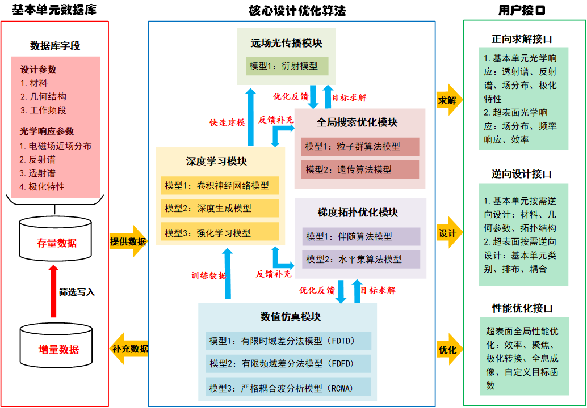

# 智能软件平台建设

基于智能算法的微纳光学逆向设计平台构架如下图1.1所示，整个设计平台分为基本单元数据库、核心设计优化算法和用户接口三大部分。其中基本单元数据库储存了现有器件的设计参数和相应的光学响应，数据库中的数据可以直接用于特定的实际应用、为优化算法提供合理的初始设计或者作为深度学习模块的训练数据使用，数据库会随着设计平台的使用不断产生增量数据，进而扩展模型的设计能力。

 图1 基于智能算法的微纳光学逆向设计软件平台构架图 

核心设计优化算法部分分为5个模块，每个模块中又包含各自的子模型。优化算法以数值仿真模块为基础，通过深度学习模块可以实现从结构到光学响应的快速端到端设计，牺牲部分精度实现快速多样性的设计结果；而梯度拓扑优化模块和全局搜索模块为迭代式算法，运行时间较长，但可以针对设计目标进行高精度优化；远场光传播模块是针对微纳光学器件的远场响应，进行解析或者半解析处理，提高模型的优化效率。

在用户接口部分，逆向设计平台将提供求解、设计和优化三个功能接口。求解接口主要用于器件光学响应的正向求解，既可以直接调用数值仿真模块进行精确模拟仿真，也可调用深度学习和远场传播模块进行快速光学响应的预测；设计接口则用于给定所需要的光学响应，逆向追溯满足条件的微纳光学结构；优化接口用于给定设计目标函数，对现有的初始设计进行优化，或者直接与逆向设计接口联合使用，对逆向设计给出的设计结果直接进行优化。

基于智能算法的微纳光学逆向设计软件平台将提供C++或Python等主流编程语言的接口，并以docker等操作系统级虚拟容器的形式部署到服务端。智能逆向设计平台服务将支持Windows、Linux等主流操作系统的调用，同时，根据当前主流商用光电子仿真软件（如Lumerical、CST等）的编程API，设计平台也将提供简洁的调用接口，保证在智能逆向设计中可以利用目前商用软件成熟的数据库和一些求解模块，对设计结果进行验证。

对于常规的超表面透镜、滤波器、偏振片等器件，智能微纳光学逆向设计软件将提供便捷的用户界面（UI），使用者只需输入待设计优化的目标参数，即可实现全自动化设计并输出最终的器件版图和性能预测，这将极大推动微纳光学器件的标准化设计流程。

同时，针对用户高度定制化的设计需求，智能逆向设计软件平台也将通过C++或Python等主流编程语言提供灵活的接口，用户可以通过编程接口方便地调用软件平台中的核心算法模块，从而根据自身需求设计定制超表面、硅基光电子器件、表面等离子体基元器件等多种微纳光学器件。

