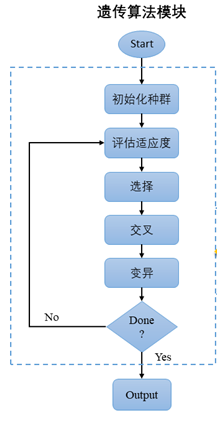
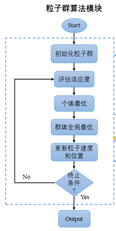

### 全局优化算法

#### 1. 遗传算法（GA，Generative Algorithm）

遗传算法是应用最广泛的全局优化技术之一，多用于离散优化问题。它将问题的求解过程转换成类似生物进化中的染色体基因的交叉、变异等过程。在求解较为复杂的组合优化问题时,相对一些常规的优化算法,通常能够较快地获得较好的优化结果。

遗传算法中每一条染色体，对应着遗传算法的一个解决方案，一般我们用适应性函数来衡量这个解决方案的优劣。所以从一个基因组到其解的适应度形成一个映射。可以把遗传算法的过程看作是一个在多元函数里面求最优解的过程。

<span><div style="text-align: center;">



</div></span>
<center> 图1 遗传算法流程图</center>

遗传算法的基本运算过程如下：

1. 初始化：设置进化代数计数器{math}`t=0`，设置最大进化代数T，随机生成M个个体作为初始群体{math}`P(0)`。 
2. 个体评价：计算群体{math}`P(t)`中各个个体的适应度。
3. 选择运算：将选择算子作用于群体。选择的目的是把优化的个体直接遗传到下一代或通过配对交叉产生新的个体再遗传到下一代。选择操作是建立在群体中个体的适应度评估基础上的。
4. 交叉运算：将交叉算子作用于群体。遗传算法中起核心作用的就是交叉算子。
5. 变异运算：将变异算子作用于群体。即是对群体中的个体串的某些基因座上的基因值作变动。群体{math}`P(t)`经过选择、交叉、变异运算之后得到下一代群体{math}`P(t+1)`。
6. 终止条件判断：若{math}`t=T` ，则以进化过程中所得到的具有最大适应度个体作为最优解输出，终止计算。

遗传操作包括以下三个基本遗传算子：选择、交叉、变异。

+ 选择

  从群体中选择优胜的个体，淘汰劣质个体的操作叫选择。

+ 交叉

  把两个父代个体的部分结构加以替换重组而生成新个体。这导致后代与父代样本具有一定程度的相似性。

+ 变异

  对群体中的个体串的某些基因座上的基因值作变动。这导致了样本彼此之间有一定程度的差异。


#### 2. 粒子群算法(PSO，Particle Swarm Optimization)

粒子群算法适用于连续优化问题，是另一种群体智能优化算法，源于对鸟群捕食的行为研究 。

粒子群算法最初是受到飞鸟集群活动的规律性启发，进而利用群体智能建立的一个简化模型。粒子群算法在对动物集群活动行为观察基础上，利用群体中的个体对信息的共享使整个群体的运动在问题求解空间中产生从无序到有序的演化过程，从而获得最优解。

+ 粒子属性

在粒子群算法中，每个粒子具有两个属性：速度和位置。速度代表移动的快慢，位置代表移动的方向。

每个粒子都有一个由目标函数决定的适应值，并且知道自己到目前为止发现的最好位置{math}`pbest`和现在的位置 {math}`x_i`。这个可以看作是粒子自己的飞行经验。除此之外，每个粒子还知道到目前为止整个群体中所有粒子发现的最好位置{math}`gbest`(gbest是pbest中的最优值)，这个可以看作是粒子同伴的经验。粒子就是通过自己的经验和同伴中最好的经验来决定下一步的运动。 

+ 更新方式

粒子群算法初始化为一群随机粒子(随机解)，然后通过迭代找到最优解。在每一次的迭代中，粒子通过跟踪两个“极值”{math}`pbest，gbest`来更新自己。在找到这两个最优值后，粒子通过下面的公式分别来更新自己的速度和位置。

```{math}
    v_i=v_i+c_1\times rand()\times (pbest_i-x_i)+c_2\times rand()\times (gbest_i-x_i)
```


```{math}
    x_i=x_i+v_i
```

> {math}`rand()`：介于{math}`(0,1)`之间的随机数
>
> {math}`c_1` 和 {math}`c_2` ：学习因子，通常均设为2。 

<span><div style="text-align: center;">



</div></span>

<center> 图2 粒子群算法流程图 </center>

综上，粒子群算法的基本运算过程如下：

1. 初始化一群例子(群体规模为{math}`N`)，包括随机位置和速度；

2. 评价每个粒子的适应度；

3. 对每个粒子，将其适应值与其经过的最好位置{math}`pbest`作比较，如果较好，则将其作为当前的最好位置{math}`pbest`；

4. 对每个粒子，将其适应值与其经过的最好位置{math}`gbest`作比较，如果较好，则将其作为当前的最好位置{math}`gbest`；

5. 更新每个例子的速度和位置；

6. 终止条件判断：若 {math}`t=T` ，则以进化过程中所得到的具有最大适应度个体作为最优解输出，终止计算。

