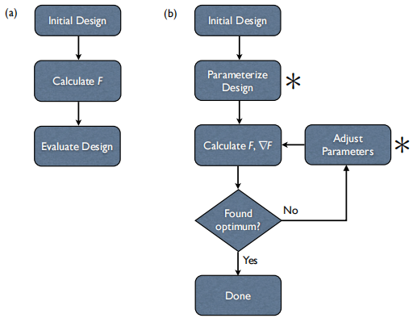
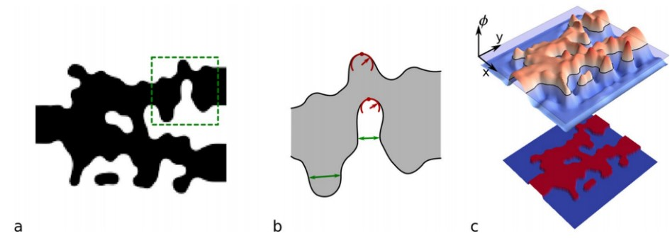
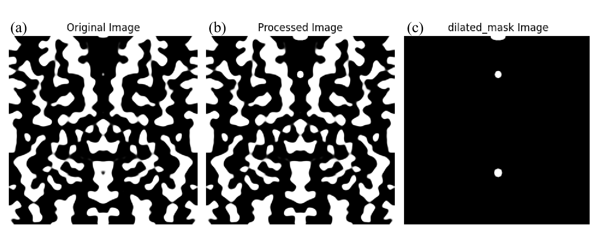

# 梯度拓扑优化算法

## 1. 逆向设计介绍

### 1.1 逆向设计算法框架介绍

&emsp;&emsp;逆向设计是实现超紧凑、高性能、新功能集成硅光子器件极具吸引力的新型方法。逆向设计过程中，已知输入与输出参数，通过对设计区域参数的修改得到相对理想的结果。<br>
&emsp;&emsp;如图1.1(a)所示，在常规（前向）设计中，已知输入 {math}`x_n`(n为自然数)，且输出 {math}`y_n`与输入 {math}`x_n`之间存在约束式{math}`F_n`,在设计中给定设计区参数{math}`ρ_n`,得到输出{math}`y_n=F_n(x_n,ρ_n)`。
在对输出结果进行优化时，通过多次改变设计区参数{math}`ρ_n`（如粒子群优化算法），得到依据于初始参数的最优解。<br>
&emsp;&emsp;如图1.1(b)所示，在逆向设计中，设计模型由方程组{math}`F_n(x_n,ρ_n)=y_n`表示，已知输入{math}`x_n`以及希望得到的输出{math}`y_n`,对{math}`F_n(x_n,ρ_n)=y_n`求解，得到设计区参数{math}`\hat{p}_n`。
在对输出结果进行优化时，通过多次比价输出{math}`\hat{y}_n`与希望得到的输出{math}`y_n`之间的差值，改变设计区参数{math}`\hat{p}_n`，使输出结果接近输出{math}`y_n`,得到设计参数{math}`ρ_n`的最优解。
<span><div style="text-align: center;">


</div></span>

<center>图1.1(a)前向设计流程示意图；(b)逆向设计流程示意图</center>

### 1.2 基于梯度下降的伴随法介绍

&emsp;&emsp;伴随法是一种用于在数值优化问题中有效计算函数或算子的梯度的数值方法。基于梯度下降的伴随法具有迭代次数少，仿真时间短等优点。<br>
&emsp;&emsp;如图1.1.所示,在优化过程中，依据约束方程组{math}`F_n(x_n,y_n)`构建度量函数{math}`G_n(x_n,ρ_n)`，度量函数{math}`G_n`用来描述设计参数{math}`\hat{ρ}_n`时，对应的输出{math}`\hat{y}_n`,与目标输出{math}`y_n`的距离，当{math}`G_n(x_n,ρ_n)`取最小值时，即可认为取得了涉及区域的最优解。<br>
&emsp;&emsp;由于{math}`G_n(x_n,ρ_n)=min`为不易求解的方程，考虑到其参数与约束条件{math}`F_n(x_n,ρ_n)`相同，构建拉格朗日函数，对函数L关于{math}`ρ_n`求解偏微分，当偏微分为零时，取得的含有拉格朗日乘子的等式即为伴随等式，伴随式在物理意义上等价于将所需的输出对场强的导数注入系统，并逆向运行系统得到的输出结果。<br>
&emsp;&emsp;对{math}`G_n(x_n,ρ_n)`关于{math}`ρ_n`求解偏微分，可得当对设计区参数{math}`ρ_n`进项微小扰动时对输出结果的影响程度，即梯度。梯度在数学上等价于前向仿真在设计区得到的数值与伴随仿真的数值乘积的实部。梯度对着迭代次数减小，即可得到{math}`G_n(x_n,ρ_n)`的最小值。
<span><div style="text-align: center;">


</div></span>

<center>图1.2 基于梯度下降的伴随优化算法</center>

## 2. 基于密度的拓扑优化算法
&emsp;&emsp;基于密度的拓扑优化对每个像素的设计进行参数化，使每个像素要么是“固体”（一种高的折射率材料），“空隙”（一种地折射率的材料），要么是两者之间的一些非物理插值。
一系列涉及过滤器和投影的转换用来逐步二值化设计，使其所有都是实的或者空的，通常也可以施加各种优化约束来强制执行设计规则（比如最小长度尺寸、面积和曲率）。
这种基于密度的拓扑优化算法是允许像素在优化过程中采用虚拟的插值材料“密度”，因此得到的目标函数（及其梯度）是平滑和连续可微的，这是基于梯度优化算法的一个重要要求，
相比于水平集的优化算法，它在求微分和优化过程中更胜一筹。

### 2.1 过滤

&emsp;&emsp;拓扑优化中时常会伴随着网格依赖性、棋盘格以及灰度单元过多等现象。这些现象会导致实体与空洞交接模糊不清，影响材料识别，为了得到如下图2.1所示那样的清晰的优化构型，目前常用的解决方法是先通过过滤，密度过滤的主要思想是修改细胞的密度，从而影响目标器件性能，使其依赖于给定领域内的密度场。 
滤波是通过使用滤波器函数和密度的卷积乘积来实现的。
但是过滤之后会导致实体与空洞交界处灰度单元的增加，所以还需要通过Heaviside投影得到清晰的优化构型。
<span><div style="text-align: center;">


</div></span>

<center>图2.1 过滤及投影过程</center>

### 2.2 投影
&emsp;&emsp;得到经过过滤的密度场之后，对其进行基于光滑的Heaviside函数的投影操作，得到投影后的密度。关于Heaviside函数的表达式如下：<br>
 ```{math}
 \bar{ρ}_i=\frac{tanh(βη)+tanh(β(\tilde{ρ}_i-η))}{tanh(βη)+tanh(β(1-η))}
 ```
&emsp;&emsp;其函数中的参数η为投影阈值，即当单元密度小于η时，则Heaviside函数将改单元的密度向0方向投影；反之，当单元密度大于η时，则Heaviside函数将该单元的密度向1方向投影。其中参数β控制着Heaviside函数在阈值参数η附近的陡峭程度，当β趋近于无穷时，Heaviside函数则接近为阶跃函数。


## 3. 基于水平集的拓扑优化算法

### 3.1 水平集方法思想

&emsp;&emsp;水平集的基本思想是将界面看成高一维空间中某一函数{math}`φ(x)`的零水平集，同时界面的演化也扩充到高一维的空间中。我们将水平集函数按照它所满足的发展方程进行的演化或迭代，由于水平集函数不断进行演化，所以零水平集也在不断变化，当水平集演化趋于平稳时，演化停止，得到界面形状,如图3.1所示。
<span><div style="text-align: center;">


</div></span>

<center>图3.1 水平集表示</center>

### 3.2 水平集拓扑优化流程

#### 3.2.1 构建初始水平集函数

 &emsp;&emsp;在水平集方法中，设计边界由水平集函数{math}`φ(x)`的零水平轮廓定义，结构是由水平集函数取正值的域定义，进行材料的初始分布，即：<br>
```{math}
     ρ=\begin{cases}0,& ∀x∈Ω；φ<0 \\ 1,& ∀x∈Ω；φ≥0 \end{cases}
 ```

#### 3.3.2 构建拉格朗日函数
 &emsp;&emsp;根据设计目标和制造约束来构建拉格朗日函数，如下：
```{math}
    L(x)=J(x)+λx(V(x)-V_{max}) +\frac{1}{2Λ}(V(x)-V_{max})^2
```
 &emsp;&emsp;其中，J(x)是优化目标函数，{math}`V(x)-V_{max}`是给定的等式约束，λ和Λ是两个拉格朗日系数，更新策略为：

```{math}
    λ^{k+1}=λ^{k}+\frac{1}{Λ^k}(V(x)-V_{max})Λ^{k+1}=αΛ^k
```

 &emsp;&emsp;其中，权重系数{math}`α∈(0,1)`。


### 3.3.3 更新水平集函数
 &emsp;&emsp;最常见的水平集函数更新通过哈密顿-雅可比方程来解决：
```{math}
    \frac{\partial φ}{\partial t}+V(x)|\nabla φ| =0
```

 &emsp;&emsp;在优化过程中，t是一个伪时间代表设计的演变，v是所谓的速度函数，或速度场，{math}`\nabla φ`为水平集函数的梯度。边界的动态变化被水平集函数控制。根据新的水平集函数确定新的材料分布和新的拉格朗日函数。

 ## 4. 添加制造限制约束
基于拓扑优化的光子逆向设计是一种强大的器件设计方法，在这种方法中，性能（如传输功率）可以优化数千或数百万自由度，表征制造器件的每个“像素”，允许完全意想不到的设计与前所未有的性能出现。然而，拓扑优化的巨大设计自由必须受到实际制造过程的限制，能满足那些商业半导体铸造厂的工艺约束，如图4.1所示。因此，本软件基于经典的密度的拓扑优化框架，施加了最小线宽、线间隔和曲率，最小面积和最小封闭面积约束，所有这些都没有实现任何额外的重新参数化。
<span><div style="text-align: center;">


</div></span>
<center>图4.1 半导体铸造厂的五种基本设计规则约束。一维约束包括线宽限制(a)、间隙限制(b)和曲率半径限制(c),二维约束包括面积限制(d)和封闭面积限制(e),在超表面拓扑单元结构中违反DRC的例子用各自的颜色(f)突出显示</center>

### 4.1 添加最小线宽，最小间隙，最小曲率半径约束
在拓扑的固体和空隙区域上强制执行最小的长度尺度。这些特殊的约束完全对应于一个铸造厂的设计规则手册的最小线宽和最小线间隔约束。约束通过识别拐点区域来工作，这些区域决定了在战略选择的侵蚀和扩张后设计拓扑是否保持不变。如果拓扑结构是一致的（即没有额外的“孔”或“岛”），那么就满足了长度尺度。强制执行实现此过程的优化约束需要一个指示符函数能够识别拐点区域和过滤器核和必要的侵蚀/膨胀之间的已知关系，最小线宽约束{math}`g_{Lw}≤0`由该函数描述：
 ```{math}
 g_{Lw}=\frac{1}{n}\sum_{i∈N} I_i^{Lw}(ρ_i)·[min{(\tilde{\rho_i}-η_e),0}]^2
 ```

 其中，{math}`I_{i}L_{W(ρ)}`是一个指示函数，用来识别固相的变化区域：
 ```{math}
 I_i^{Lw}(\rho)=\bar{\rho}·exp(-c\left| \nabla{\tilde{\rho}} \right|^2)
 ```

 其中，c是指示指标函数的“强度”的阻尼项。最小线间隔约束，{math}`g_{LS}`≤0，用一个类似的函数来描述:
 ```{math}
 g_{Ls}=\frac{1}{n}\sum_{i∈N} I_i^{Ls}(ρ_i)·[min{(\tilde{\rho_i}-η_d),0}]^2
 ```

 其中，{math}`I_{i}L_{S(ρ)}`是一个指示函数，用来识别空隙阶段的变化区域：
 ```{math}
 I_i^{Ls}(\rho)=(1-\bar{\rho})·exp(-c\left| \nabla{\tilde{\rho}} \right|^2)
 ```

 要从铸造的最小线宽{math}`lw`和最小间距{math}`ls`确定{math}`η_{e}`和{math}`η_{d}`，以下关系保持:
 ```{math}
 \eta_e = \begin {cases} \frac{1}{4}(\frac{lw}{R})^2+\frac{1}{2}, & \frac{lw}{R}∈[0,1]  \\  -\frac{1}{4}(\frac{lw}{R})^2+\frac{lw}{R}, & \frac{lw}{R}∈[1,2]   \\ 1,   & \frac{lw}{R}∈[2，∞）    \end {cases}
 ```
  ```{math}
 \eta_d = \begin {cases} \frac{1}{2}- \frac{1}{4}(\frac{ls}{R})^2, & \frac{ls}{R}∈[0,1]  \\  1+\frac{1}{4}(\frac{ls}{R})^2-\frac{ls}{R}, & \frac{ls}{R}∈[1,2]   \\ 0,   & \frac{ls}{R}∈[2，∞）    \end {cases}
 ```

 这里的{math}`R`是用户指定的圆锥形滤波器的半径。这允许人们任意选择滤波器的半径，并从上述关系中推导出后续的阈值参数（{math}`η_{e}`和{math}`η_{d}`）。选择更小的半径允许较小的特征，但代价是潜在地“加强”相应的优化问题（即，约束Hessian可能有较大的条件数）。{math}`η_{e}`和{math}`η_{d}`的典型值分别为0.75和0.25，对应于{math}`R = 2lw = 2ls`。

 最后，我们注意到线宽和线空间约束也对固体和空隙区域的相应最小曲率进行了隐式约束。假设使用圆形滤波器并且满足约束，得到的拓扑不能包含直径小于相应长度尺度的圆形元素（例如，固体区域的线宽和空隙区域的线间距）。因此，相应的最小曲率半径{math}`k_{w,s}`被定义为:
  ```{math} 
 k_{w,s} = \frac{l_{w,s} }{2}
 ```

 ### 4.2 添加最小面积和封闭面积约束
 接下来，是对二维平面的约束，首先，指示器函数识别违反最小面积约束的区域（“岛屿”）和违反最小封闭面积约束的区域（“洞”）。接下来，每个约束都将鼓励优化器通过局部侵蚀（对于岛屿）或局部扩张（对于孔洞）来消除破坏区域。下图说明了一个样本设计（图4.2(a)）上的最小面积约束函数，使用图像分割算法识别违反规则的区域（图4.2(c)），不违反规则的区域保留，违反的区域根据我们设计的大小进行约束（图4.2(b)）。
 <span><div style="text-align: center;">


</div></span>

<center>图4.2 最小面积限制（a）原始样本 (b)约束后的样本（c）识别违反规则区域</center>