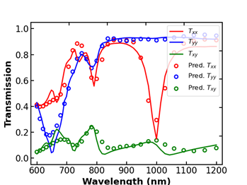

# 深度学习算法

## 1.深度学习优化算法

### 1.1 神经网络模型

#### 1.1.1 模型简介

深度学习是机器学习的一个分支，这个概念源于人工神经网络的研究，神经网络通过组合低层特征形成更加抽象的高层表示特征，并利用这些特征来进行决策。

图1.1 含两个隐层的深度学习模型

如图1.1所示，含多个隐藏层的多层感知器就是一种深度学习结构。输入层指输入到神经网络的数据；隐藏层是数据处理的核心部分，数据将穿过隐藏层，并由许多权重调节；输出层是神经网络传递数据的结果，也是人们试图达到的目标。

#### 1.1.2 实例—用于预测光谱的前向预测模型

图1.2 前向预测模型预测自由形状超表面结构光谱响应

光学设计中的前向预测模型通常是输入光学器件结构，经神经网络输出相应的光学响应。在本模型中，前向预测模型的功能如图1.2所示。输入为64×64pixel表示的自由形状超表面结构; 输出为600~1200nm的波长范围内均匀采样61个波长点的不同极化方式的透射系数。其中实线为CST仿真的真实光谱，散点为前向预测模型的输出光谱。

具体的前向预测模型的网络结构示意图如下图1.3所示。

图1.3 前向预测模型的网络结构示意图

图1.4 前向预测模型的预测光谱与实际光谱的对比图

该模型的预测光谱的单点mse误差为0.0081，图1.4展示了前向预测模型的预测效果。其中实线为真实的透射谱，散点为前向预测模型输出的预测光谱。

### 1.2 深度生成模型

#### 1.2.1 模型简介

VAE(Variational Autoencoder,变分自动编码器)是一种深度生成模型，其模型如图1.5所示。通过编码器生成特征，然后解码器重构出原来的特征，并让重构出来的特征和输入的特征尽可能相似。

图1.5 VAE模型概述图

VAE模型的损失函数由KL散度和重建误差两部分组成，KL散度用来衡量图形的真实分布与高斯分布的差异程度，重建误差用来衡量重建图像与输入图像的相似程度，两者均越小越好。通过结合KL散度和重建误差，VAE模型平衡了生成数据的多样性和生成数据与原始数据的相似性。

#### 1.2.2 实例—生成自由形状超表面结构

 图1.6 VAE用于超表面逆向设计

在本实例中，VAE模型用于超表面逆向设计的示意图如图1.6所示。将自由形状超表面结构输入编码器encoder中，输出其高斯分布的均值μ和标准差σ，经重采样后得到编码z，结合自由形状超表面结构的光谱一同输入到解码器decoder中，经decoder生成新的超表面结构。具体的网络结构如下图1.7所示。

图1.7 本设计中的VAE模型的网络结构图。

(a)编码器网络结构；(b)解码器网络结构。
