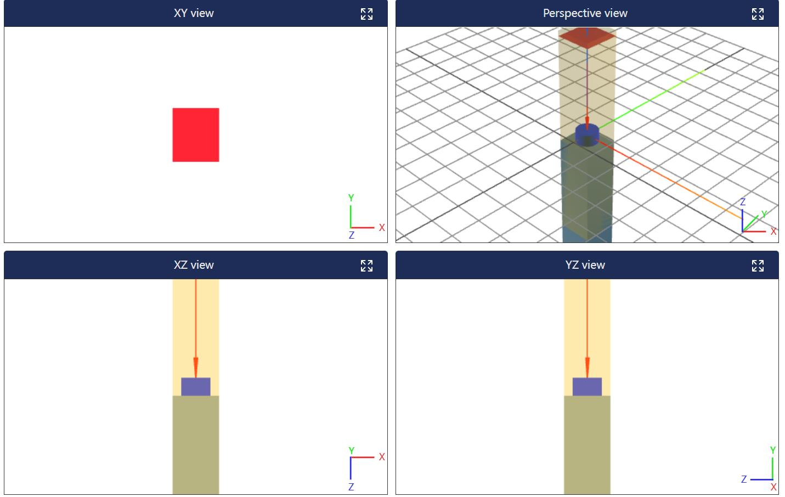
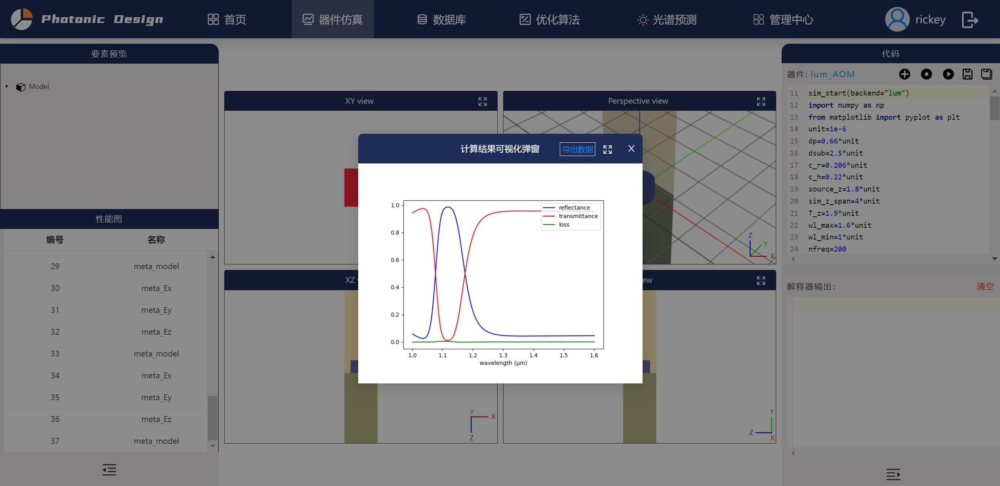
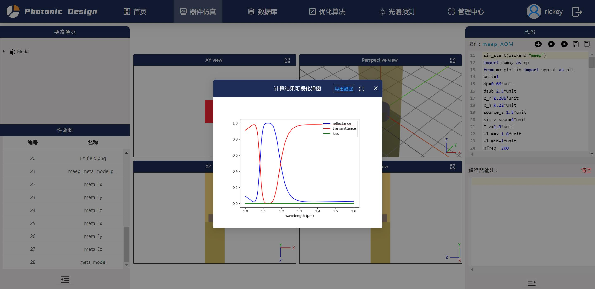

# 教程/微纳结构

## Meta结构建模仿真

微纳光学智能设计软件支持meep/Lumerical/CST环境建模仿真，并统一接口代码让用户使用，本节给出超表面单元结构的建模示例，运行完成后软件会生成光谱图像。

<center> 图1 Meta结构建模展示 </center>

这里给出的是Meta结构建模仿真的统一代码：
1. Lumerical 环境
```
###lum环境###
sim_start(backend="lum")
import numpy as np
from matplotlib import pyplot as plt
unit=1e-6
dp=0.66*unit
dsub=2.5*unit
c_r=0.206*unit
c_h=0.22*unit
source_z=1.8*unit
sim_z_span=4*unit
T_z=1.9*unit
wl_max=1.6*unit
wl_min=1*unit
nfreq=200

unity_sim.set_sim_paras(wl_max=wl_max,wl_min=wl_min,T_z=1.9*unit,nfreq=nfreq,resolution=50)

###添加结构
unity_sim.define_material('SiO2',1.5) # 定义材料
unity_sim.define_material('Si',3.4) # 定义材料
block=unity_sim.add_block(size=(dp, dp, dsub), center=(0, 0, -c_h/2-dsub/2), material_name='SiO2',color='gray') # 添加方块
cylinder=unity_sim.add_cylinder(radius=c_r, center=(0,0,0), material_name='Si',height= c_h,color='blue') # 添加方块

####添加源，监视器
unity_sim.add_source(size=(dp,dp,0), center=(0,0,source_z))
unity_sim.add_sim_area(size=(dp,dp,sim_z_span), center=(0,0,0))
unity_sim.add_monitor(size=(dp,dp,0), center=(0,0,T_z),name="R")
unity_sim.add_monitor(size=(dp,dp,0), center=(0,0,-T_z),name="T")
unity_sim.add_monitor_field(size=(dp,dp,0), center=(0,0,-T_z))

###运行
unity_sim.run(pt=(0, 0, -T_z))

result = unity_sim.get_result_monitor(name="T")
result1 = unity_sim.get_result_monitor(name="R")

wl = result["wl"]
T = result["power"]
R = result1["power"]

#提取电场
E_total = ["Ex", "Ey", "Ez"]

for i in E_total:
    fig, ax = plt.subplots(1, 1)
    data = unity_sim.get_result_monitor_field()
    E = data[i]
    plt.imshow(E[0], origin="lower")
    plt.colorbar()
    ax.set_title(f"{i}_field")
    np.savetxt(f"meta_{i}.txt", E[0])
    plt.savefig(f"meta_{i}.png")
    device.save_fig(f"meta_{i}", file_path=f"meta_{i}.png",file_data_path=f"meta_{i}.txt")

####提取光谱图
wls = []
Rs = []
Ts = []

for i in range(nfreq):
    wls = np.append(wls, wl[i])
    Rs = np.append(Rs, R[i])
    Ts = np.append(Ts, -T[i])
data = np.zeros((len(wls), 4))
data[:, 0] = wls #
data[:, 1] = Rs  #
data[:, 2] = Ts  #
data[:, 3] = 1 - Rs - Ts  #
np.savetxt("data_meta_model.txt", data)  #

plt.figure()
plt.plot(wls, Rs, 'b', label='reflectance')
plt.plot(wls, Ts, 'r', label='transmittance')
plt.plot(wls, 1 - Rs -Ts, 'g', label='loss')
plt.xlabel("wavelength (μm)")
plt.legend(loc="upper right")
plt.savefig("meta_model.png")
device.save_fig("meta_model", file_path="meta_model.png",file_data_path="data_meta_model.txt")

sim_end(backend="lum")
```

示例运行后的结果展示：

<center> 图2 lumerical环境运行结果 </center>

2. Meep 环境
```
sim_start(backend="meep")
import numpy as np
from matplotlib import pyplot as plt
unit=1
dp=0.66*unit
dsub=2.5*unit
c_r=0.206*unit
c_h=0.22*unit
source_z=1.8*unit
sim_z_span=4*unit
T_z=1.9*unit
wl_max=1.6*unit
wl_min=1*unit
nfreq =200

fmax = 1 / wl_min
fmin = 1 / wl_max
fcen = (fmin + fmax) / 2
df = fmax - fmin
dpml = 1 / fcen/ 2

unity_sim.set_sim_paras(wl_max=wl_max,wl_min=wl_min,T_z=1.9*unit,nfreq=nfreq,resolution=50)

###添加结构
unity_sim.define_material('SiO2',1.5) # 定义材料
unity_sim.define_material('Si',3.4) # 定义材料
block=unity_sim.add_block(size=(dp, dp, dsub), center=(0, 0, -c_h/2-dsub/2), material_name='SiO2',color='gray') # 添加方块
cylinder=unity_sim.add_cylinder(radius=c_r, center=(0,0,0), material_name='Si',height= c_h,color='blue') # 添加方块

####添加源，监视器
unity_sim.add_source(size=(dp,dp,0), center=(0,0,source_z))
unity_sim.add_sim_area(size=(dp,dp,sim_z_span+ 2 * dpml), center=(0,0,0),geometry=False)
inc = unity_sim.add_monitor(size=(dp,dp,0), center=(0,0,T_z))
R = unity_sim.add_monitor(size=(dp,dp,0), center=(0,0,T_z))

#####第一次运行
unity_sim.run(pt=(0, 0, -T_z))

result = unity_sim.get_result_monitor(inc)
result1 = unity_sim.get_flux(R)

input_flux = result["power"]
unity_sim.reset()

unity_sim.add_sim_area(size=(dp,dp,sim_z_span), center=(0,0,0),geometry=True)
T = unity_sim.add_monitor(size=(dp,dp,0), center=(0,0,-T_z))
R = unity_sim.add_monitor(size=(dp,dp,0), center=(0,0,T_z))
E_field = unity_sim.add_monitor_field(size=(dp,dp,0), center=(0,0,-T_z))
unity_sim.load_minus_flux_data(R,result1)

####第二次运行
unity_sim.run(pt=(0, 0, -T_z))

result = unity_sim.get_result_monitor(T)
result1 = unity_sim.get_result_monitor(R)


flux_freqs = result["f"]
tran_flux = result["power"]
refl_flux = result1["power"]


##提取电场
E_total = ["Ex", "Ey", "Ez"]

for i in E_total:
    fig, ax = plt.subplots(1, 1)
    data = unity_sim.get_result_monitor_field()
    E = data[i]
    plt.imshow(np.flipud(np.transpose(E)), origin="lower")
    plt.colorbar()
    ax.set_title(f"{i}_field")
    np.savetxt(f"meta_{i}.txt", E)
    plt.savefig(f"meta_{i}.png")
    device.save_fig(f"meta_{i}", file_path=f"meta_{i}.png",file_data_path=f"meta_{i}.txt")

###提取光谱图
wls = []
Rs = []
Ts = []

for i in range(nfreq):
    wls = np.append(wls, 1 / flux_freqs[i])
    Rs = np.append(Rs, refl_flux[i] / input_flux[i])
    Ts = np.append(Ts, -tran_flux[i] / input_flux[i])
data = np.zeros((len(wls), 4))
data[:, 0] = wls #
data[:, 1] = Rs  #
data[:, 2] = Ts  #
data[:, 3] = 1 - Rs - Ts  #
np.savetxt("data_meta_model.txt", data)  #

plt.figure()
plt.plot(wls, Rs, 'b', label='reflectance')
plt.plot(wls, Ts, 'r', label='transmittance')
plt.plot(wls, 1 - Rs - Ts, 'g', label='loss')
plt.xlabel("wavelength (μm)")
plt.legend(loc="upper right")
plt.savefig('meta_model.png')
device.save_fig('meta_model', file_path='meta_model.png',file_data_path="data_meta_model.txt")

sim_end(backend="meep")
```

示例运行后的结果展示：

<center> 图3 meep环境运行结果 </center>