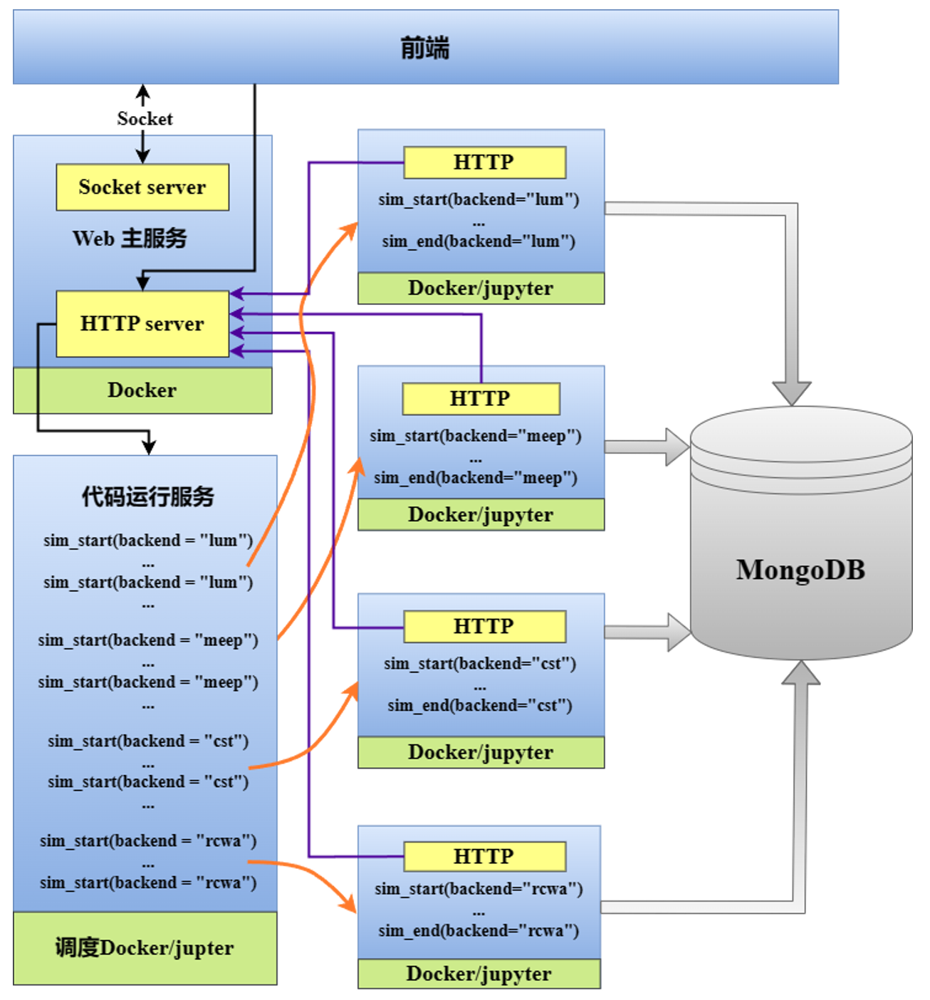

# 软件设计框架及原理

基于智能算法的微纳光学逆向设计软件平台，包括微纳光学正向及逆向仿真功能。微纳智能软件可进行数值仿真，并且能够实现与主流商用光电子软件-Lumerical及CST联合仿真。用户可在软件代码区域使用统一API设计FDTD、Lumerical及CST环境所使用的模型。
软件是基于容器建立后端服务，通过调度容器对代码区域上下文的分析，将对应的算法片段发送到远程的执行软件执行，并且收集结果，将建模及结果展示在前端软件中。其中前端与调度容器通过HTTP协议传送信息，不同算法容器的计算结果保存在MongoDB中。

 图1 软件架构原理图 

