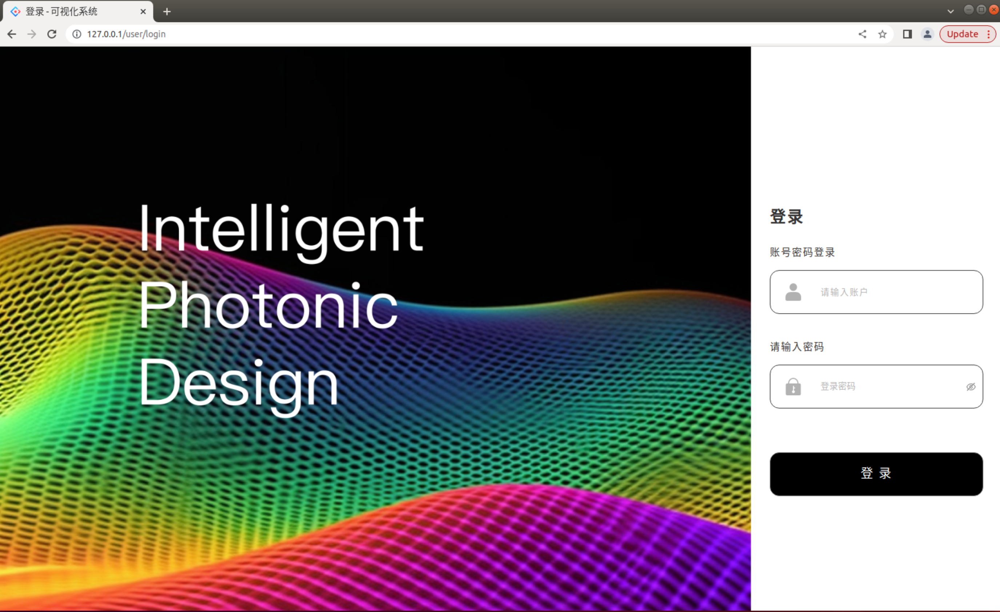

# 软件安装
现阶段微纳光学智能设计软件安装是将不同算法环境下/不同Dockerfile制作的**Docker镜像**部署到Linux主机或虚拟机，通过启动yml文件来运行智能设计软件。因此本地Linux主机或虚拟机需安装Docker和Docker-compose环境.
## 什么是Docker？
Docker 是一个开源的应用容器引擎，基于 Go 语言 并遵从 Apache2.0 协议开源。Docker 可以让开发者打包他们的应用以及依赖包到一个轻量级、可移植的容器中，然后发布到任何流行的 Linux 机器上，也可以实现虚拟化。容器是完全使用沙箱机制，相互之间不会有任何接口（类似 iPhone 的 app）,更重要的是容器性能开销极低。

因此Docker可以屏蔽环境差异，只要程序被Docker打包后，那么无论运行在什么环境下程序的行为都是一致的，可以做到真正实现“build once, run everywhere”。

此外Docker的另一个好处就是快速部署，一个原因是容器启动速度非常快，另一个原因在于只要确保一个容器中的程序正确运行，那么你就能确信无论在生产环境部署多少都能正确运行。

Docker包括三个基本概念：
+ **镜像（Image）**：Docker 镜像（Image），就相当于是一个 root 文件系统。比如官方镜像 ubuntu:16.04 就包含了完整的一套 Ubuntu16.04 最小系统的 root 文件系统。
+ **容器（Container）**：镜像（Image）和容器（Container）的关系，就像是面向对象程序设计中的类和实例一样，镜像是静态的定义，容器是镜像运行时的实体。容器可以被创建、启动、停止、删除、暂停等。
+ **仓库（Repository）**：仓库可看成一个代码控制中心，用来保存镜像。一个 Docker Registry 中可以包含多个仓库（Repository）；每个仓库可以包含多个标签（Tag）；每个标签对应一个镜像。通常，一个仓库会包含同一个软件不同版本的镜像，而标签就常用于对应该软件的各个版本。我们可以通过 <仓库名>:<标签> 的格式来指定具体是这个软件哪个版本的镜像。如果不给出标签，将以 latest 作为默认标签。

## Linux本地安装Docker engine及Docker compose
根据本地Linux系统选择对应的docker engine及docker-compose版本进行安装，下载链接：**[ubuntu系统安装docker engine](https://download.docker.com/linux/ubuntu/dists/ )**，**[centos系统安装docker engine](https://download.docker.com/linux/centos/7/x86_64/stable/Packages/)**，**[Linux安装docker-compose](https://github.com/docker/compose/releases/download/v2.16.0/docker-compose-linux-x86_64)**。

**Docker Engine**是Docker的核心组件，它是一个轻量级的容器管理工具，可以在Linux、Windouws和macOS上运行。Docker Engine通过使用容器技术将应用程序及其所有依赖打包成可移植的容器，从而实现了应用程序在不同环境中的快速部署和运行。

**Docker Compose**是一个工具，用于定义和运行多个Docker容器的应用程序。它使用YAML文件来定义容器、网络、数据卷等，并提供一组命令来管理这些资源。Docker Compose可以在单个主机上运行多个容器，也可以在多个主机上运行容器。用户可以使用docker-compose up命令来启动所有容器，使用docker-compose down命令来停止所有容器。
## 启动微纳光学智能设计软件
通过Git命令拉取微纳光学智能设计软件后端代码，进入下载文件夹后open terminal执行：
```
docker-compose -f docker-compose-production.yml up
```
启动软件后会创建多个容器：
```
[+] Running 4/4
 \u283f Network sd0523b_default        Created                                  0.3s
 \u283f Container sd0523b-mongo-1      Created                                  2.1s
 \u283f Container sd0523b-front-end-1  Creat...                                 2.1s
 \u283f Container web                  Created                                  1.0s
```
对系统进行初始化：
- 进入后端容器中，执行命令：docker exec -it web bash
- 创建软件的第一个管理员用户，管理员用户的用户名及密码可在拉取的代码test/api_test/login.py文件中修改，执行命令：python test/api_test/login.py
  
  *要注意的是，需要进入web bash容器内部修改test/api_test中的common.py文件里的HOST内容，可采用文件替换形式（docker cp）*

初始化软件后默认在HOST= 'http://127.0.0.1/api'部署软件，也可以在服务器所在IP下登入软件页面

<center> 图4.1 软件部署首页展示 </center>

## 更新微纳光学智能设计软件
由于算法迭代以及公共接口进一步开发，微纳光学智能设计软件需要更新，更新步骤如下：
- 关闭软件后台，在部署的Linux系统中后端文件夹下使用docker-compose-production.yml down，暂停容器运行
- 根据对应docker file制作最新版镜像（前端、后端以及meep镜像），本地制作完成后推送到镜像仓库中
- 在部署的Linux系统中下载最新版镜像（meep需要），或者在docker-compose-production.yml文件中更新前后端镜像地址
- 修改好yml文件后，需要重新启动软件，即docker-compose -f docker-compose-production.yml up
- 智能设计软件更新完毕，用户可正常访问微纳光学智能设计软件
- 在meep工程环境下更新meep镜像地址
- 联合仿真Windows环境中也需要重新下载后端文件夹

## 联合仿真Windows环境部署
微纳光学智能设计软件能够实现与**主流商用光电子软件Lumerical及CST**联合仿真，由于商用软件安装环境为Windows系统与智能设计软件无法兼容，因此设计团队开发了agent服务，用来监听管理端的通知，当获取执行通知后会调用Python SDK执行相关的算法，运行结束通过Websocket返回管理端数据库。

Windows服务器需安装Lumerical及CST软件，并且在C:\Windows\System32\drivers\etc\host文件中添加系统Web服务器以及MongoDB服务器的IP地址，格式如下：
```
xxx.xxx.xxx.xxx      mongo
xxx.xxx.xxx.xxx      web
```
下载安装[python 3.7.9](https://www.python.org/ftp/python/3.7.9/python-3.7.9-amd64.exe)和[python 3.6.8](https://www.python.org/ftp/python/3.6.8/python-3.6.8-amd64.exe)分别用于Lumerical以及CST。

安装好商用软件及对应的python环境后需要配置虚拟环境以及安装依赖：
- Windows服务器C盘目录下建立venv目录
- 执行命令激活python环境：
    ```
    cd c:/venv
    python3.7路径/python -m venv py37
    cd c:/venv/py37/Scripts
    activate

    #python3.6同步设置
    cd c:/venv
    python3.6路径/python -m venv py36
    cd c:/venv/py36/Scripts
    activate
    ```
- 同样拉取后端代码到Windows本地服务器中，将main.py中的WINDOWS_SERVER_IP = '47.96.109.121' 修改为Windows机器IP地址
- 安装项目依赖，执行代码：
    ```
    #设置镜像源
    pip config set global.index-url https://pypi.tuna.tsinghua.edu.cn/simple
    cd sd0523/window_server/
    #安装依赖(根据实际的requirements文件路径)
    pip install -r requirements.txt # python3.7环境 python3.6安装requirements36.txt
    ```
- 最后运行Windows agent服务，CMD进入代码目录后执行：c:/venv/py37/Scripts/python main.py


