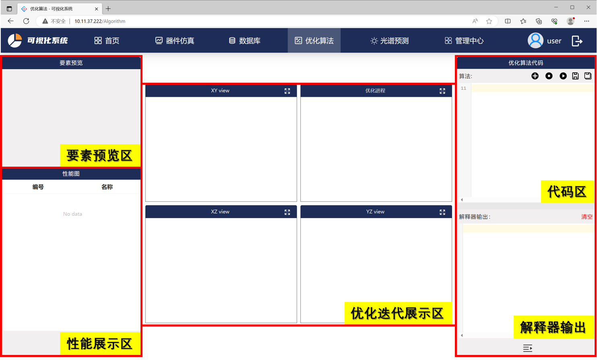
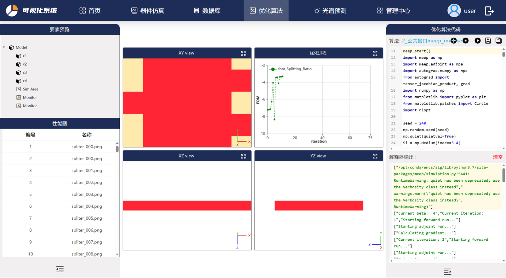

# 优化算法
## 优化算法模块介绍

所开发的基于人工智能的微纳光学器件设计方法融合了深度学习模型、梯度优化算法和启发式优化算法，充分利用深度学习模型的泛化性能、梯度优化算法的高校优化特点和启发式模型算法的全局搜索能力，可以对特定的设计目标按需设计，并面向具体需求将性能推向极限。软件优化算法模块包括 **[梯度拓扑优化算法模块](https://intelligent-software-design.readthedocs.io/zh_CN/latest/%E7%AE%80%E4%BB%8B/%E6%A0%B8%E5%BF%83%E8%AE%BE%E8%AE%A1%E4%BC%98%E5%8C%96%E7%AE%97%E6%B3%95/%E6%A2%AF%E5%BA%A6%E6%8B%93%E6%89%91%E4%BC%98%E5%8C%96%E6%A8%A1%E5%9D%97/%E6%A2%AF%E5%BA%A6%E6%8B%93%E6%89%91%E4%BC%98%E5%8C%96%E7%AE%97%E6%B3%95.html)** 中的伴随算法和水平集算法、**[全局搜索优化模块](https://intelligent-software-design.readthedocs.io/zh_CN/latest/%E7%AE%80%E4%BB%8B/%E6%A0%B8%E5%BF%83%E8%AE%BE%E8%AE%A1%E4%BC%98%E5%8C%96%E7%AE%97%E6%B3%95/%E5%85%A8%E5%B1%80%E6%90%9C%E7%B4%A2%E4%BC%98%E5%8C%96%E6%A8%A1%E5%9D%97/contents.html)** 的粒子群算法等。

优化算法建模需要用户将python建模代码输入至软件优化算法模块的**优化算法代码区**中，前端采用CodeMirror在线代码编辑器使得用户可以在对应的算法环境中定义仿真模型，点击运行按钮即可进行迭代仿真。与此同时模型会通过Three.js框架实现3D效果展示，在**优化迭代展示区**中XY view、YZ view、XZ view二维平面显示模型的视图，同时器件优化进程会展示在**优化进程**窗口中。

 图1 优化算法模块页面展示 

软件数据库中提供多种优化算法模型，器件类型为优化示例，点击加号即可加载优化示例器件，用户可在基础模型上进行修改。代码区显示的按钮从左到右依次表示：
+ 加号按钮：加载优化算法示例，器件存储于模型库中
+ 暂停按钮：运算过程中点击，仿真强停止
+ 开始按钮：开始进行仿真，模型构建
+ 保存按钮：将代码区中的建模代码保存于器件中
+ 另存为按钮：将代码区中的模型另存为新器件

器件仿真过程中的状态会实时显示在解释器输出窗口中，当运行完毕后会显示 ***FINISHED***。模型相关要素会在**要素预览区**显示，包括模型结构、监视器、仿真区域等关键组件。运算过程中按照代码区编写存储的的性能图、模型图等显示在**性能展示区**，并会将图片保存至数据库对应的器件性能图中。

器件仿真过程展示在下图中，显示的是1×2 power spliter的优化进程。

 图2 优化算法过程展示 

## 优化算法tips
因软件还在开发阶段，用户搭建模型需按照已给定的实例进行改写，或者使用软件提供的API进行模型构建：
* 用户需按照API规则进行模型构建，对于监视器、模型构建等关键建模语句需提供必要的参数等
* 如若仿真过程中出现循环卡死或其他事件可点击代码上方的暂停按钮
* 代码区和性能展示区可左右、上下拖拽
