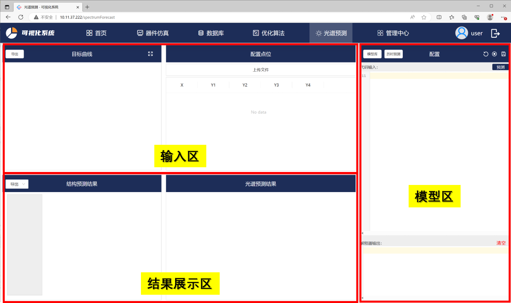
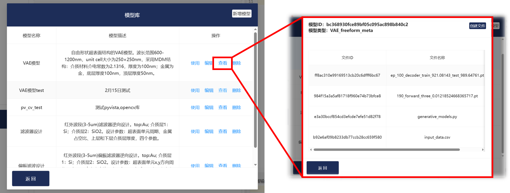
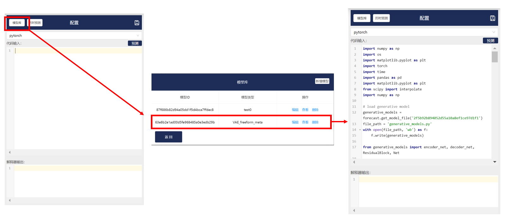
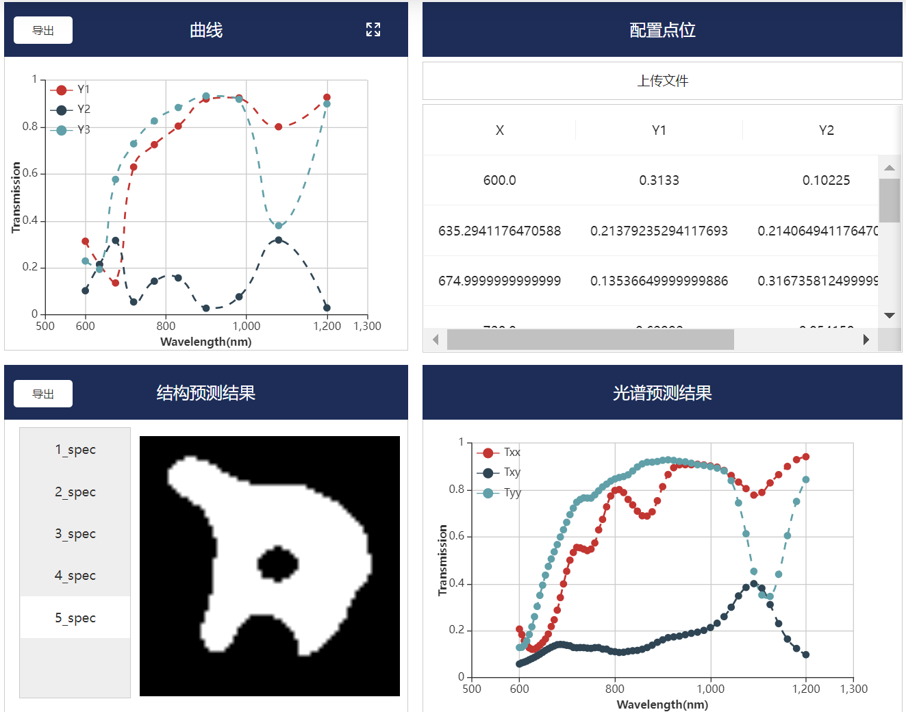

# 光谱预测

## 1. 光谱预测模块功能简介

首先点击光谱预测模块，进入初始化页面：



<center>图1.1 光谱预测模块初始化界面</center>

本页面的各功能模块基于VAE模型开发（VAE模型介绍详见[深度学习模块](https://intelligent-software-design.readthedocs.io/zh_CN/latest/算法/深度学习模块/深度学习模型.html#id6)）。

本页面可分有三个功能区域：**输入区、模型区、结果展示区**。

输入区上传并展示传入VAE模型的光谱数据，模型区用于选择光谱预测的模型，结果展示区用于展示VAE模型的多样性预测结果。

以下是输入区和结果展示区中各模块的详细介绍：

+ 输入区**曲线模块**：绘制”配置点位“模块中上传的数据。
+ 输入区**配置点位模块**：点击"上传模型"，上传本地csv文件。csv文件格式：光谱数据按列排列，第一列为横坐标数据，其余列为纵坐标数据。
+ 结果展示区**结构预测结果模块**：展示VAE模型的多样性结果。"导出"按钮导出右侧光谱预测结果的CSV文件或版图GDS文件。
+ 结果展示区**光谱预测结果模块**：展示左侧微纳光学结构对应的光谱预测结果，可与目标曲线直观进行对比。


<center> 图1.2 模型区配置模块</center>

在模型区**配置模块**中：

+ 点击模型库：可添加/删除模型。点击“查看”，可上传模型中用到的模型文件。在模型中，通过“文件ID”调用上传的模型文件：

```
#load generative model
generative_models = forecast.get_model_file('e3a30bccf854cd3efcde7efe51d82f78')
file_path = 'generative_models.py'
```
模型库中保存模型名称及模型参数化描述，用户可以点击操作中的功能来使用、编辑、查看或者删除模型。


<center>图1.3 模型库界面及配置文件查看窗口</center>

+ 历时预测：保存历时预测结果。通过点击右上角的保存标志保存。
+ 代码输入：点击模型后，在此处输入必要的参数，比如最大迭代测试、单点预测误差、制造限制等。
+ 预测：运行模型代码，该模型对输入数据的预测。
+ 解释器输出：运行模型代码时的python解释器输出。
+ 可点击停止按钮强停止仿真过程

## 2. 光谱预测使用实例

本节以自由形状结构超表面的[VAE模型](https://intelligent-software-design.readthedocs.io/zh_CN/latest/算法/深度学习模块/深度学习模型.html#id8)。

Step1: 选择模型：



<center>图2.1 选择模型</center>

Step2: 上传输入模型的光谱数据。

该模型输入x的范围为600-1200，y的范围为0-1。


<center>图2.2 上传模型数据</center>

上传后，点位可在y方向上拖动，右侧可查看拖动后点位的精确数值。模型预测读取的是实时的输入数据。

Step3：点击“预测”，得到预测结果。



<center>图2.3 模型预测结果</center>