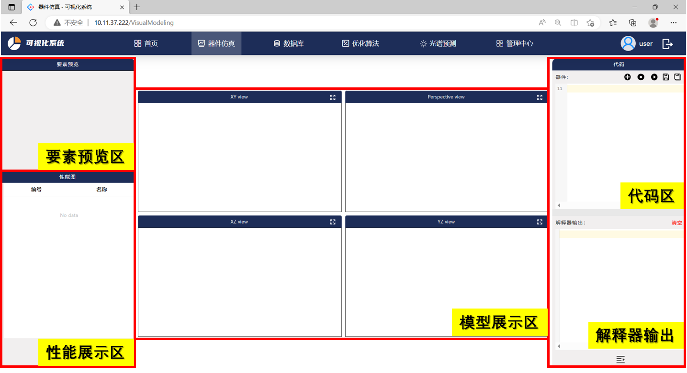
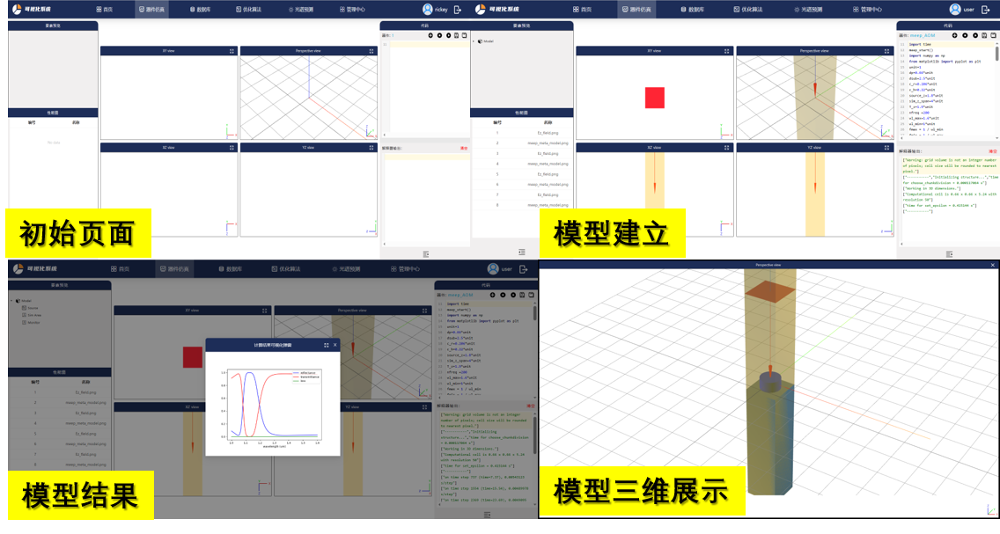

# 器件仿真

## 器件仿真模块介绍

器件仿真建模需要用户将python建模代码输入至软件器件仿真模块的**代码区**中，前端采用CodeMirror在线代码编辑器使得用户可以在对应的算法环境中定义仿真模型，点击运行按钮即可进行器件仿真。与此同时模型会通过Three.js框架实现3D效果展示，在**模型展示区**中XY view、YZ view、XZ view二维平面以及Perspective View三维视角显示模型的视图，并且通过拖动鼠标及滑动鼠标滚轴可拖拽模型方向及缩放。

 图1 器件仿真模块页面展示 

现阶段软件可提供**FDTD底层算法结构**以及**与Lumerical、CST商业软件联动算法背景**，需要用户切换算法环境。具体的API接口使用方法及示例详见：**[软件API接口及示例](https://intelligent-software-design.readthedocs.io/zh_CN/latest/%E8%BD%AF%E4%BB%B6API%E6%8E%A5%E5%8F%A3/contents.html)**。

软件数据库中提供多种光学器件模型，点击加号即可加载器件，用户可在基础模型上进行修改。代码区显示的按钮从左到右依次表示：
+ 加号按钮：加载器件，器件存储于模型库中
+ 暂停按钮：运算过程中点击，仿真强停止
+ 开始按钮：开始进行仿真，模型构建
+ 保存按钮：将代码区中的建模代码保存于器件中
+ 另存为按钮：将代码区中的模型另存为新器件

器件仿真过程中的状态会实时显示在解释器输出窗口中，当运行完毕后会显示 ***FINISHED***。模型相关要素会在**要素预览区**显示，包括模型结构、监视器、仿真区域等关键组件。运算过程中按照代码区编写存储的的性能图、模型图等显示在**性能展示区**，并会将图片保存至数据库对应的器件性能图中。

器件仿真过程展示在下图中，包括软件初始页面、模型建立中、模型仿真运行完毕后的结果展示、以及建模Perspective View全屏后的模型展示。

 图2 器件仿真过程展示 

## 器件仿真tips
因软件还在开发阶段，用户搭建模型需按照已给定的实例进行改写，或者使用软件提供的API进行模型构建：
* 用户需按照API规则进行模型构建，对于监视器、模型构建等关键建模语句需提供必要的参数等
* 如若仿真过程中出现循环卡死或其他事件可点击代码上方的暂停按钮
* 代码区和性能展示区可左右、上下拖拽
