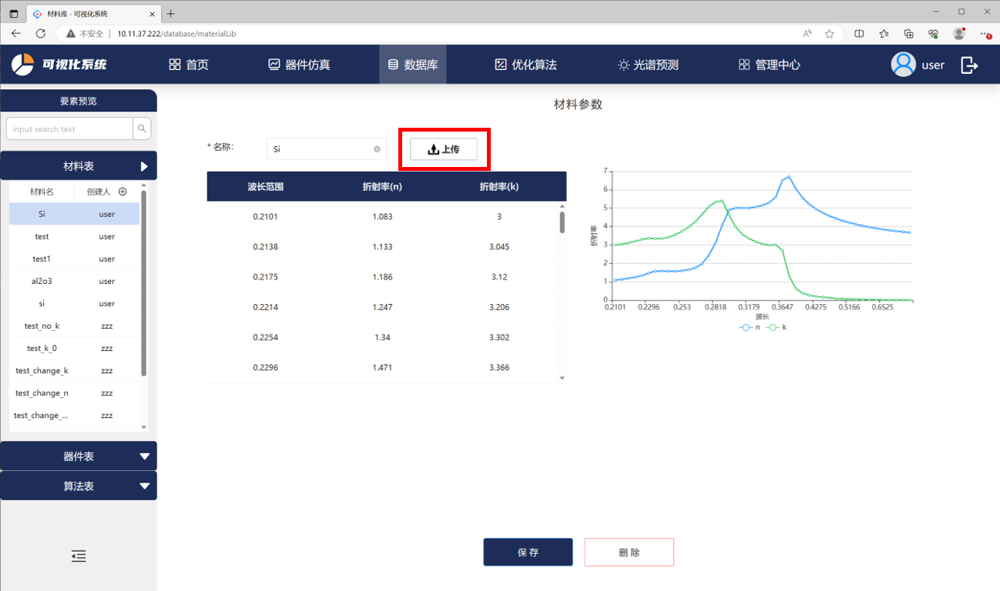
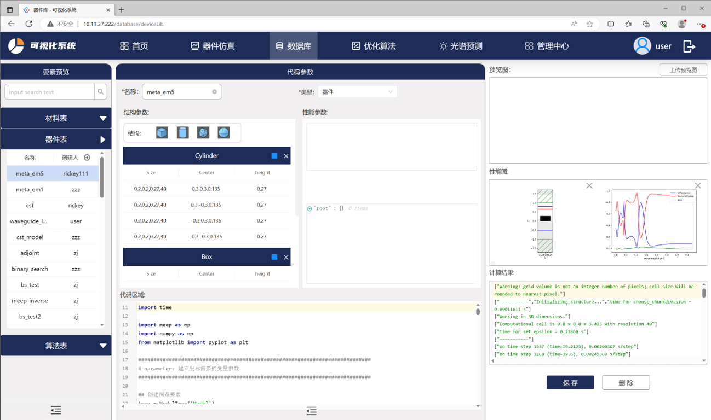

# 数据库

## 数据库——材料库
智能软件系统提供用户定义的特殊材料，用户可自定义并上传特定材料在各个波段的性能数据并在模型构建中使用。
点击上传按钮即可添加以xls、xlsx及csv文件存储的材料折射率，文件第一列为波长，第二、第三列分别为材料的n、K值。如图所示，添加完成后的材料折射率会显示在折线图中。

<center> 图1 材料库页面展示 </center>
用户可在器件仿真中调用材料表中的折射率，其中字符串中输入存储的材料名：

```
data = device.get_material('xxxx')
# data数据提取
# data['wave']: 材料波长信息
# data['n']: 材料折射率n
# data['k']: 材料折射率k
```
## 数据库——器件库
在器件仿真及优化算法模块中用户运行的模型及结果按照类型保存在器件库中，器件表有模型结构参数信息、建模代码区域、模型预览图、性能图及计算结果展示：

<center> 图2 器件库页面展示 </center>

+ 结构参数包含模型结构的中心坐标，大小及高度
+ 代码区域记录模型建模及参数提取所用代码
+ 性能图存储模型仿真结果
+ 计算结果记录模型仿真过程中的解释器输出
### 器件库中添加/删除器件
软件支持用户新添加器件，点击器件表中的加号，输入器件名称及类型后点击保存即可在仿真模块中使用。用户也可以在器件仿真或优化算法模块中另存为功能添加器件。同时，拥有管理员权限的用户可以在数据库中删除器件。

## 数据库——算法库
软件系统算法库中保存了不同环境的镜像地址及域名，现可提供：
* 基于MEEP的FDTD算法环境
* 与Lumerical/CST商用软件可调用的算法环境
* 用于光谱预测的pytorch算法环境

